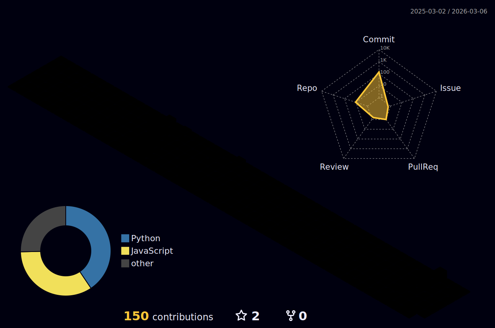

# Bonjour, I'm Ashiful Islam Ridoy! 👋

  

**Data Engineer** with 2+ years building scalable data solutions using Azure Cloud Platform. Currently pursuing M.Sc. Web and Data Science at Universität Koblenz, Germany.

## 🛠️ Tech Stack

**Languages:** Python, Java, JavaScript, SQL  
**Cloud & Data:** Azure Data Factory, Databricks, Apache Spark, Power BI  
**ML/AI:** TensorFlow, PyTorch, OpenCV  
**Databases:** PostgreSQL, MySQL, MongoDB  

## 🏆 Recent Certifications
- Apache Spark™ Programming with Databricks (2024)
- Advanced Data Engineering with Databricks (2024)

## 🎯 Featured Projects

**🤖 AI Resume Generator** - Personalized resume creation using Google Gemini AI and Streamlit  
**👤 Face Recognition System** - Real-time attendance system with 98% accuracy using OpenCV  
**📧 Newsletter Summarizer** - Automated Gmail processing with Cohere AI integration  

## 📊 GitHub Stats

  
  

## 📫 Connect

 

---

<i>Building scalable data solutions, one pipeline at a time ⚡</i>

