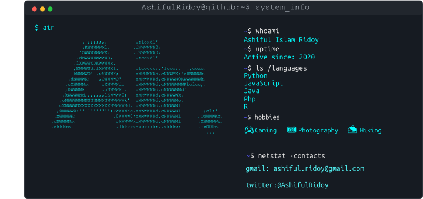

# Bonjour, I'm Ashiful Islam Ridoy! 👋

<h3 align="center">👨‍💻 Data Engineer & Machine Learning Specialist | MSc Web & Data Science (Koblenz)</h3>

---

### About Me

I'm a data-driven engineer passionate about building **scalable pipelines**, **intelligent systems**, and **human-centered automation**.  
With 2+ years of industry experience, I specialize in:

- 🧩 **End-to-end ML systems** (from training to real-time inference)
- 🔧 **Cloud-native data engineering** (Azure Data Factory, Databricks)
- 🤖 **Agentic AI & LLM frameworks** (LangChain, LangGraph, RAG, DeBERTa, LLaMA)
- 📊 **Explainable AI** (DeepLIFT, LIME, SHAP, counterfactual explanations)

Currently pursuing my Master's in **Web & Data Science** at Universität Koblenz, Germany 🇩🇪

---

### Work Experience

#### Digital Infrastructure Architect
**GIZ (GET.transform)** ·  
**Apr 2026 – Present**

- Developed large-scale ML infrastructure for the GET.transform initiative, processing terabyte-scale energy and infrastructure datasets through distributed **Apache Spark**, **Kafka**, and **Airflow** pipelines while enabling scalable model training and inference workflows.
- Designed automated **MLOps** systems including feature engineering pipelines, model monitoring, drift detection, experiment tracking, and continuous retraining, improving forecasting model reliability and reducing manual operational overhead.
- Built and deployed a production-grade **RAG** platform using **LangChain**, vector search, semantic retrieval, and LLM-powered reasoning on **SageMaker**, delivering an AI-powered policy intelligence solution for climate, NDC, and SDG document analysis.

**Key Technologies:** Apache Spark, Kafka, Airflow, Python, SageMaker, LangChain, RAG, Vector Search, MLOps, MLflow, Model Monitoring, Drift Detection

---

#### R&D Application & ML Engineer  
**Elevate Solutions Limited** ·  
**Aug 2022 – Apr 2024**

- Built and deployed production ML models for classification and forecasting using **PyTorch**, **Azure ML**, and **Docker**, establishing scalable inference pipelines and reducing deployment time by **40%**.
- Developed automated **MLOps** workflows and end-to-end data pipelines with **Azure Data Factory**, **Databricks**, and **SQL**, cutting pipeline latency by **35%** while ensuring consistent model performance through CI/CD and versioning.

**Key Technologies:** PyTorch, Azure ML, Docker, Azure Data Factory, Hugging Face, MLflow, CI/CD

---

#### Data Engineer Intern  
**Elevate Solutions Limited** · *Dhaka, Bangladesh*  
**May 2022 – Aug 2022**

- Designed robust ETL pipelines with **Azure Data Factory** and **Databricks**, consolidating multiple data sources into a centralized warehouse for ML model training.
- Optimized ML dataset preparation workflows using **PySpark** and **SQL** in Azure Databricks, reducing preprocessing time by **25%** through automated data cleaning and feature engineering processes.

**Key Technologies:** PySpark, SQL, Azure Data Factory, Azure Databricks, Data Modeling, ML Pipelines

---

### 🚀 Projects & Research

#### Explainable AI for Ethical Counter Speech Generation in Hate Speech Mitigation — Universität Koblenz
- Built a multi-agent NLP system using **DeBERTa-v3** and **LLaMA 3** for hate speech detection and sentiment analysis with rationale-aware response generation.
- Developed an XAI dashboard implementing **DeepLIFT**, **LIME**, **SHAP**, and counterfactual explanations with LangChain-based agent orchestration, creating a transparent AI moderation system with detailed feature importance analysis.

#### Predictive Maintenance Copilot — AI-Powered Equipment Monitoring
- Developed an AI-driven predictive maintenance system combining IoT sensor monitoring, ML inference (LSTM Autoencoder, RUL prediction, Isolation Forest) and RAG reasoning (LangGraph + vector search) to detect anomalies, predict failures, and generate explainable maintenance recommendations.
- Engineered a hybrid architecture with explainable AI, deterministic agent orchestration, evidence-backed RAG retrieval, and a real-time Streamlit dashboard for transparent insights and human-in-the-loop decisioning.

#### Pennywise — Financial RAG Assistant
- Developed a Retrieval-Augmented Generation (RAG) pipeline using SentenceTransformers and Mistral to deliver context-aware, citation-backed answers from financial documents.
- Built a Streamlit-based interface with PDF parsing (PyMuPDF), semantic chunking, vector search, and intelligent caching, enabling instant, privacy-preserving analysis of 100+ page financial reports.

---

### 🛠️ Tech Stack

**Core Skills:** Machine Learning, MLOps, Agentic AI, LLMs, Gen AI, Computer Vision, Data Visualization, Azure Cloud  
**Languages:** Python, SQL, NoSQL, Java, JavaScript  
**ML/AI:** PyTorch, TensorFlow, Hugging Face, Scikit-learn, OpenCV, Azure ML, LLM Fine-tuning, GenAI  
**Frameworks & Tools:** LangChain, LangGraph, RAG, React, FastAPI, Flask, Docker, Kubernetes, Git, CI/CD  
**Data Engineering:** Azure Data Factory, Azure Databricks, PySpark, MLflow  
**Visualization:** Power BI, Tableau

---

### 🎓 Education

**Master of Science – Web and Data Science**, Universität Koblenz  
*Apr 2024 – Present | Koblenz, Germany*

**Bachelor of Computer Science & Engineering**, International University of Business Agriculture and Technology  
*Jan 2018 – Aug 2022 | Dhaka, Bangladesh*  
Thesis: Automatic Detection System for Motorcycle Rules Violation using YOLOR in Real-time

---

### 📜 Certifications

- **Advanced Data Engineering with Databricks** – Databricks
- **Scalable Machine Learning with Apache Spark™ (V2)** – Databricks

---

### 🌐 Languages

**English (Fluent)** | **Deutsch (Intermediate)**

---

### 🤝 Let's Collaborate

Got an exciting idea? Need help with data pipelines, intelligent systems, or full-stack apps?  

I'd love to hear from you!

📧 Reach out via [Email](mailto:ashiful.ridoy@gmail.com)  
💼 Or connect on [LinkedIn](https://www.linkedin.com/in/ashifulislamridoy)  
📍 Available for freelance, part-time, and research collaborations — remote or in-person (Germany 🇩🇪)

> *"Alone we can do so little; together we can do so much." – Helen Keller*

---

---
<!--

<h3 align="left">Languages and Tools:</h3>

                                      

-->
