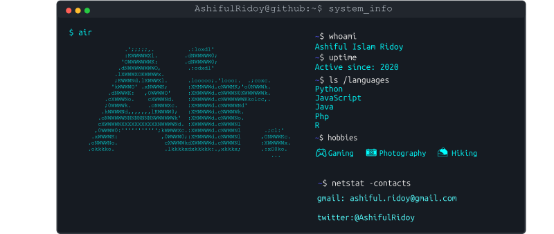

# Bonjour, I'm Ashiful Islam Ridoy! 👋

<h3 align="center">👨‍💻 Data Engineer & Machine Learning Specialist | MSc Web & Data Science (Koblenz)</h3>

---

### About Me

I'm a data-driven engineer passionate about building **scalable pipelines**, **intelligent systems**, and **human-centered automation**.  
With 2+ years of industry experience, I specialize in:

- 🧩 **End-to-end ML systems** (from training to real-time inference)
- 🔧 **Cloud-native data engineering** (Azure Data Factory, Databricks)
- ⚙️ **No-code + low-code platforms** (Power Platform, Streamlit)
- 🤖 **Machine Learning model + framework** (LangChain, DeBERTa, LLaMA)

Currently pursuing my Master’s in **Web & Data Science** at Universität Koblenz, Germany 🇩🇪

---

### Work Experience

#### R&D Application & ML Engineer  
**Elevate Solutions Limited** ·  
**Aug 2022 – Mar 2024**

- Built production-ready ML models for classification and forecasting using **PyTorch**, **Azure ML**, and **Docker**, reducing deployment time by **40%**.  
- Developed **MLOps workflows** with automated versioning & CI/CD for consistent model performance.  
- Created **ETL pipelines** with **Azure Data Factory**, **Databricks**, and **SQL**, cutting pipeline latency by **35%** through optimized connector design.  
- Delivered intelligent applications for healthcare, finance, and manufacturing clients using **React**, **Power BI**, and **Tableau**.

---

#### Data Engineer Intern  
**Elevate Solutions Limited** · *Dhaka, Bangladesh*  
**May 2022 – Aug 2022**

- Designed robust ETL pipelines consolidating data into a centralized warehouse.  
- Built interactive **Power BI** dashboards for real-time KPI visibility.  
- Optimized ML dataset preparation with **PySpark** and **SQL**, reducing preprocessing time by **25%**.

---

#### Freelance Web Developer  
**Remote / Contract**  
**Jan 2019 – Mar 2021**

- Created full-stack, database-driven websites using **React**, **Node.js**, **PHP**, and **MySQL** for clients in e-commerce, education, and services.
- Embedded **Google Analytics**, A/B testing, and tracking tools to measure and optimize UX performance.
- Provided insights through user behavior reports, resulting in a **25–40% increase in client conversion rates**.

---

### 🛠️ Tech Stack

**Languages:** Python, SQL, PySpark, Java, JavaScript, PHP  
**ML/AI:** PyTorch, TensorFlow, Hugging Face, Scikit-learn, OpenCV, Azure ML, LLM Fine-tuning, GenAI  
**Frameworks:** React, FastAPI, Flask, PyQT, JavaFX  
**Data Engineering:** Azure Data Factory, Azure Databricks, Azure SQL, PostgreSQL, Docker, CI/CD  
**Visualization:** Power BI, Tableau  
**Other Tools:** Figma, Agile/Scrum, LangChain, MLOps workflows

---

### 📜 Certifications

-  **Apache Spark™ Programming** – Databricks  
-  **Scalable Machine Learning with Apache Spark (V2)** – Databricks  
-  **Advanced Data Engineering** – Databricks

---

### 🤝 Let's Collaborate

Got an exciting idea? Need help with data pipelines, intelligent systems, or full-stack apps?  

I’d love to hear from you!

📧 Reach out via [Email](mailto:ashiful.ridoy@gmail.com)  
💼 Or connect on [LinkedIn](https://www.linkedin.com/in/ashiful-islam-ridoy/)  
📍 Available for freelance, part-time, and research collaborations — remote or in-person (Germany 🇩🇪)

> *"Alone we can do so little; together we can do so much." – Helen Keller*

---

---

<h3 align="left">Languages and Tools:</h3>

                                      

